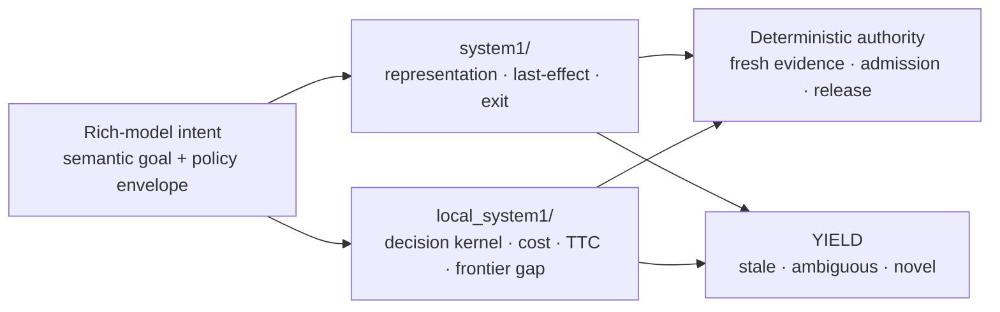

# System-1 research

This directory contains bounded fast-path / local decision experiments associated with System-1-style low-latency control.

These studies do not imply that a local model replaces the rich planner. Current project policy is to preserve rich-model intent and use local mechanisms only inside bounded, fresh-evidence-controlled authority.

## Relationship to Local System-1

```mermaid
flowchart LR
    R[Rich-model intent<br/>semantic goal + policy envelope]
    S[system1/<br/>representation · last-effect · exit]
    L[local_system1/<br/>decision kernel · cost · TTC · frontier gap]
    A[Deterministic authority<br/>fresh evidence · admission · release]
    Y[YIELD<br/>stale · ambiguous · novel]

    R --> S
    R --> L
    S --> A
    L --> A
    S --> Y
    L --> Y
```

This is a navigation view, not a mandatory runtime pipeline. Individual studies may test only one representation or decision boundary.

## Track map

| Theme | Retained studies |
|---|---|
| Latency-aware exit | [`latency_aware_exit_v1/`](latency_aware_exit_v1/), [`latency_aware_exit_v2/`](latency_aware_exit_v2/) |
| Last-effect receipt | [`map01_last_effect_receipt_v1/`](map01_last_effect_receipt_v1/) |
| Last-effect representation | [`map01_last_effect_representation_v1/`](map01_last_effect_representation_v1/), [`map01_last_effect_representation_v31_r2/`](map01_last_effect_representation_v31_r2/) |
| Intent-preserving Needle distillation | [intent_distillation_3458_pilot_01/](intent_distillation_3458_pilot_01/) |
| Online role-adapter update | [needle_lora_3441_online_stream_v1/](../needle_lora_3441_online_stream_v1/) — host-CPU online run; both online and batch misses the 0.90 gate; not container or runtime evidence. |
| Online update generation fence | [`needle_adaptive_generation_fence_4840_v1/`](needle_adaptive_generation_fence_4840_v1/) — scoped 64-row envelope/oracle pass; no model training or runtime authority. |
| Representation collision / ambiguity | [`map01_representation_collision_v1/`](map01_representation_collision_v1/) |

For lower-level local decision mechanics, route cost, TTC admission, typed evidence, and useful-work-per-frontier-boundary studies, use [`../local_system1/`](../local_system1/).

## Read next

- Current governing direction: [`../../docs/CURRENT_GOAL.md`](../../docs/CURRENT_GOAL.md)
- Research method: [`../../docs/RESEARCH_METHOD.md`](../../docs/RESEARCH_METHOD.md)
- Evidence ledger: [`../../RESEARCH.md`](../../RESEARCH.md)
- Research workspace map: [`../README.md`](../README.md)

Read each child experiment for its allowed decision vocabulary, authority boundary, and scoped disposition.

## Needle distillation successor

- [`intent_distillation_3458_pilot_02_stratified/`](intent_distillation_3458_pilot_02_stratified/) — balanced class and boundary suite; disposition FAIL_BOUNDARY_FIDELITY.

## Hybrid Needle margin successor

- [`intent_distillation_3458_pilot_03_hybrid/`](intent_distillation_3458_pilot_03_hybrid/) — scoped synthetic pass with deterministic boundary YIELD.

## Multi-seed hybrid Needle successor

- [`intent_distillation_3458_pilot_04_multiseed/`](intent_distillation_3458_pilot_04_multiseed/) — three-seed confirmatory synthetic result.

## Learned role-adapter graph

- [`needle_role_graph_3780_compact_v1/`](../needle_role_graph_3780_compact_v1/REPORT.md) — receipt-gated A→B→C LoRA role graph; scoped synthetic PASS with independent audit and an explicit provenance-label warning. #3778's separate output-capture STOP is preserved.

## Role graph as a reloadable skill

- [`needle_role_skill_reload_3780_v1/REPORT.md`](../needle_role_skill_reload_3780_v1/REPORT.md) — successor #3890; three-seed, CPU Docker, cross-process JSON-tensor reload PASS with two fresh loaders per seed and a scoped independent audit. Seed 3789 / role C is a narrow threshold pass; no production skill authority is claimed.

## Role-C support-count diagnostic successor

- [`needle_role_c_support64_diagnostic_4749_v2_7866201/STOP_REPORT.md`](needle_role_c_support64_diagnostic_4749_v2_7866201/STOP_REPORT.md) — Issue #4848's one-shot Docker allocation STOPPED before model construction on a byte-recorder TypeError; zero optimizer updates, no score, separate empty-output audit. Seed 7866201 is consumed; this does not revise #4749's formal PASS.

## Role-C support-count diagnostic successor (fresh seed)

- [`needle_role_c_support64_diagnostic_4749_v4_7866401/README.md`](needle_role_c_support64_diagnostic_4749_v4_7866401/README.md) — Issue #4853, one fresh-seed CPU Docker paired run, independent raw audit PASS; support64 improves synthetic role-C accuracy by +0.05127 at seed 7866401, A/B exact. Descriptive single-seed result only; does not alter #4749's ten-seed PASS. Full raw outputs remain in the dedicated local Docker volume; SHA-256 digests and exact source blob IDs are recorded in the evidence bundle.

## Local decoder readout and cache mechanics

- [`typed_readout_prefix_gpu_1014_v1/STOP_RECORD.md`](typed_readout_prefix_gpu_1014_v1/STOP_RECORD.md) — successor #4623 materialized a pinned Qwen2.5-0.5B model in a network-disabled RTX 3080 Docker container. Independent construction audit reproduced the FP16 full-vocabulary logit-tolerance failure; the formal latency block did not run. No typed-decision competence or runtime claim.
- [`typed_readout_code_projection_1014_v2/STOP_RECORD.md`](typed_readout_code_projection_1014_v2/STOP_RECORD.md) — successor #4639 separately tested the eight answer-code logits on the same pinned GPU assets. Independent audit reproduced a selected-score tolerance failure (B00/slot 15); the formal latency block did not run. This does not modify #4623.
- [`typed_readout_decision_equivalence_1014_v3/formal/REPORT.md`](typed_readout_decision_equivalence_1014_v3/formal/REPORT.md) — successor #4652 compares categorical winners across all 1,024 corpus questions. RTX 3080 result and independent raw-only audit both show zero winner mismatches. This does not revise the selected-score STOP or establish semantic correctness or speedup.

## Concurrent Needle online-LoRA / System-1 inference

- [`needle_concurrent_online_lora_4631_v1/RESULT_SUMMARY.md`](needle_concurrent_online_lora_4631_v1/RESULT_SUMMARY.md) — successor #4621; the sole frozen training orchestration completed, but a scalar/vector shape bug in the independent auditor stopped certification. No retry or model-quality claim.

## Concurrent Needle online-LoRA/System-1 successor

- [`needle_concurrent_online_lora_4653_v2/RESULT_SUMMARY.md`](needle_concurrent_online_lora_4653_v2/RESULT_SUMMARY.md) — successor to #4631; corrected auditor passed with zero errors, but the fourfold fixed training batch still produced fewer than eight overlapping query intervals in every seed, and one seed had two 60 Hz deadline misses. No COW candidate qualifies.

## Local Needle training invocation guard

- [`needle_single_invocation_guard_4678_v1/README.md`](needle_single_invocation_guard_4678_v1/README.md) — Issue #4678 preflight STOP: the exact #4205 GPU image is cached and matches, but its pinned safetensors checkpoint is absent; no training-image container or optimizer step ran. Two offline CPU-only audit containers validated the retained STOP record.
